# Multi-contrast-MRI-Super-Resolution

## Improving Brain MRI quality using Deep Neural Networks: Multi-Contrast Super Resolution

### Keywords: Super Resolution - 2D Convolutional Neural Networks - Brain MRI

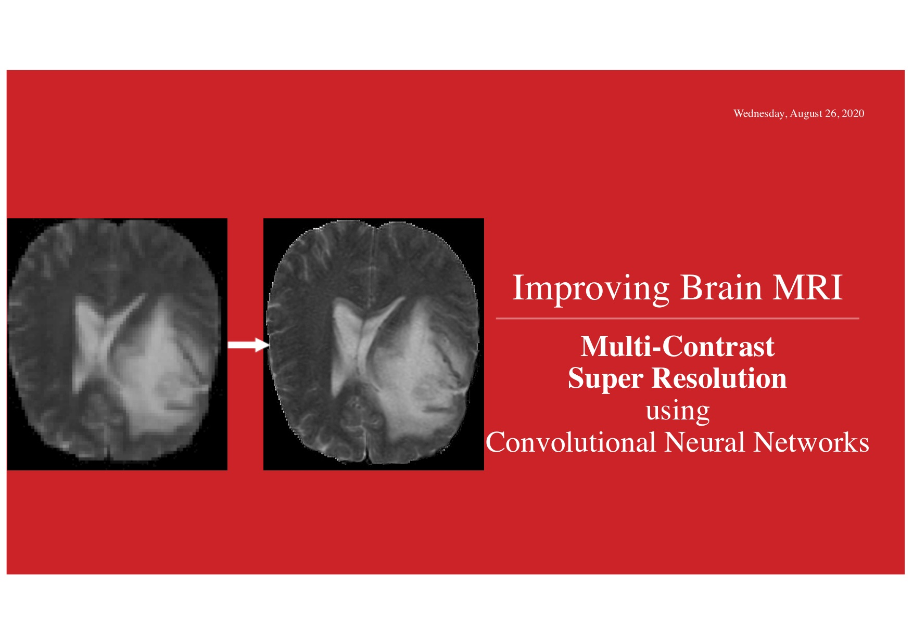

**Super Resolution** is a class of algorithms that increase the resolution of a given image. 

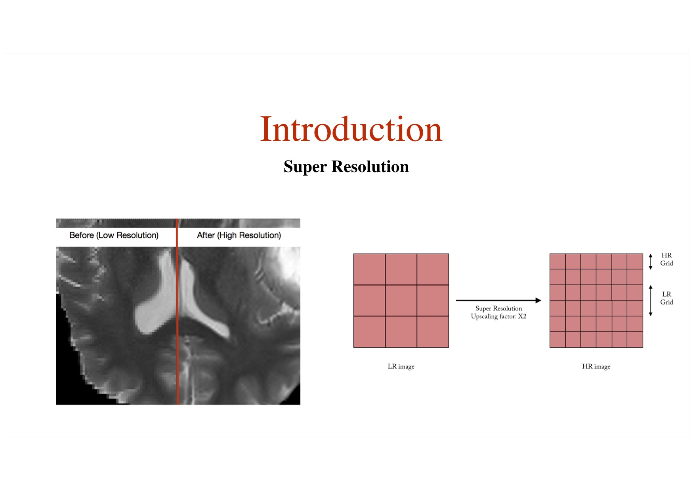

This post- processing technology is extremely useful in Medical Imaging because it overcomes hardware or practical limitations. For example, acquiring high resolution MR images is really expensive and time consuming. However, brain tumor diagnosis and treatment highly depends on Magnetic Res- onance images quality and increasing its resolution is therefore of importance.
The purpose of this study is to propose a Super Resolution model fitted for Brain Magnetic Resonance Imaging (MRI) data. To this extent, Deep Convolutional Neural Networks will be investigated (Convolutional Neural Networks _CNN_).

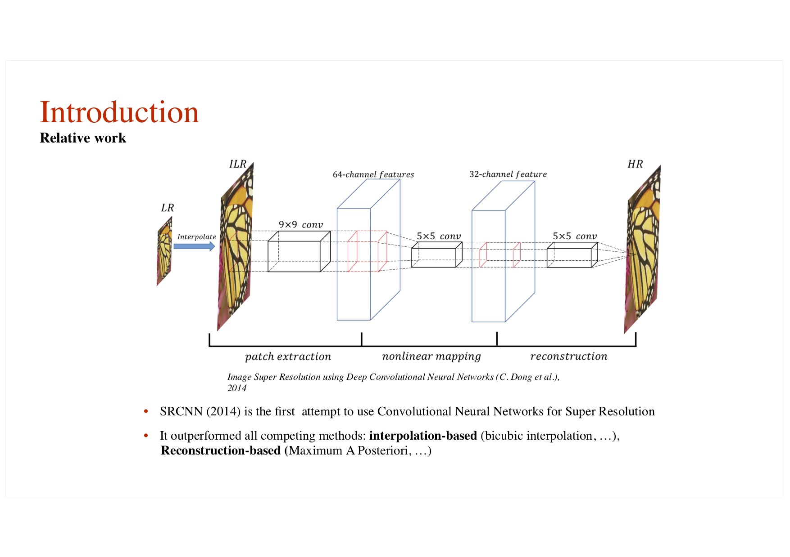

First, this work aims at establishing of a first Single-Contrast Super Resolution model adapted from state of the art architectures.
Then, the model is improved using Multi-Contrast Super Resolution.

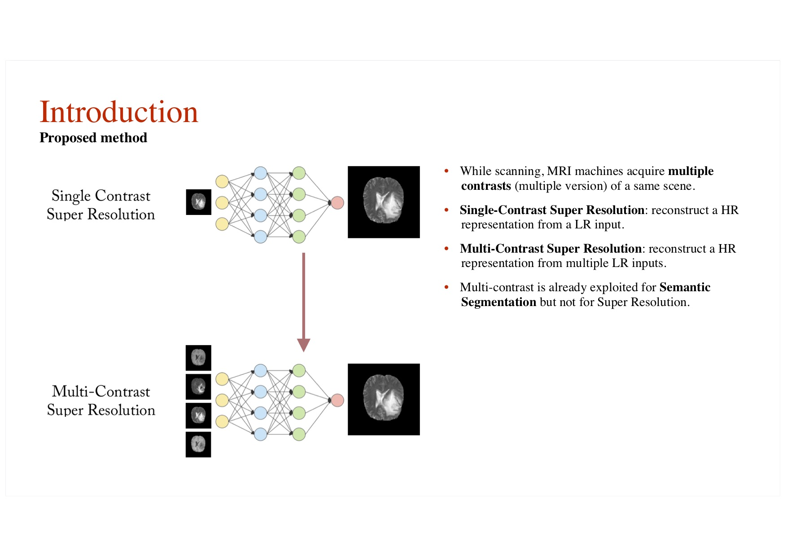

The proposed models have achieved better performances on the conducted experiments in both qualitative and quantitative terms. It does not only exceeds Single-Contrast methods (+0.4dB on PSNR in average) but also presents good learning properties.

## Training pipeline
 
Data comes from BraTS dataset which only provides High Resolution MR Images so we need to simulate the low resolution.
The network tries to super resolve the simulated LR images and we use the HR images as the reference. Then the net can be trained to super resolve MR images.

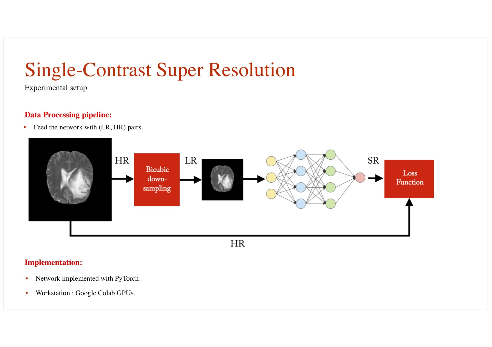

## Single Contrast Super-Resolution

** Results: **
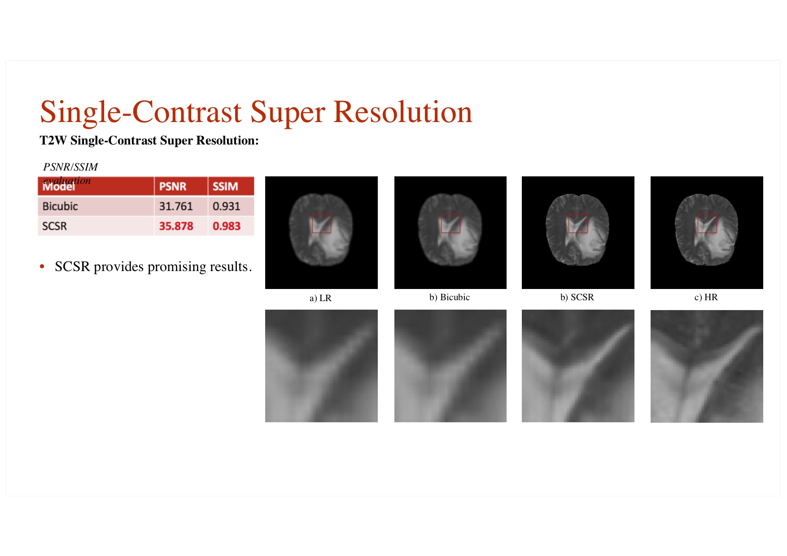

## Multi-contrast Super-Resolution

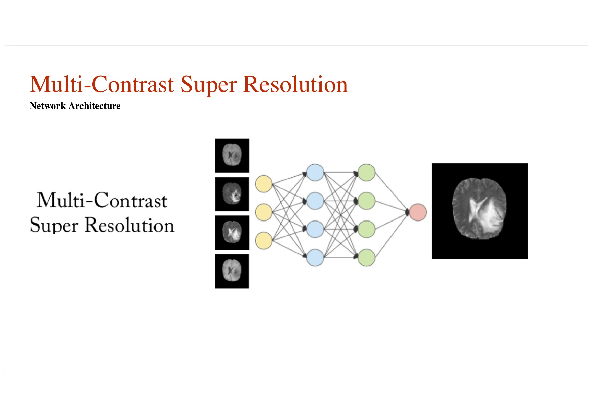

For automatic brain tumor segmentation, Multi-Contrast-based models are the norm because they have achieved far superior performances on Tumor Semantic Segmentation. This can be ex- plained by the fact that the complementarity between MRI contrasts is essential to distinguish tissue types.
But surprisingly, Multi-Contrast-based models are far less frequently explored for Super Resolution.

** The multiple _contrasts_ :**

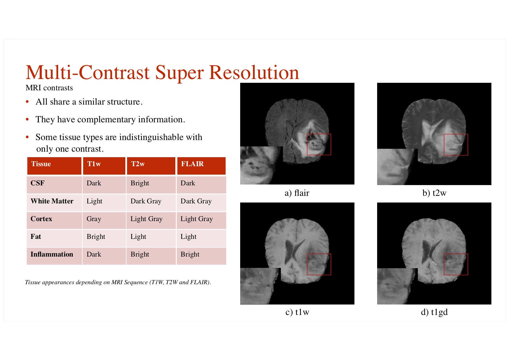

** Results: **

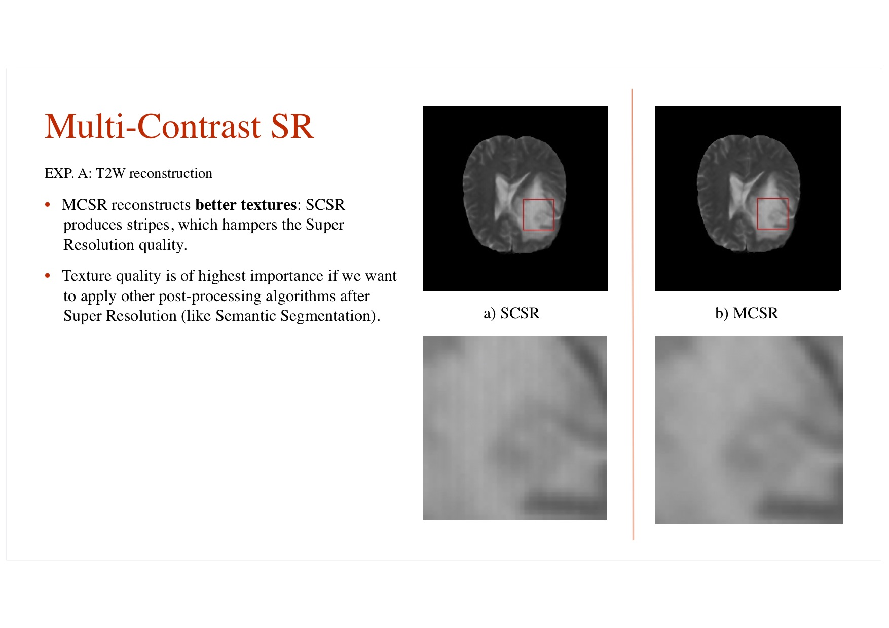
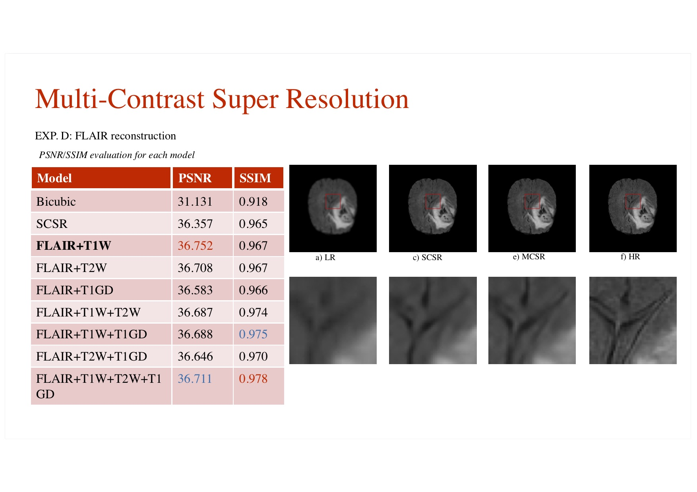

## Other advantages of using multiple contrasts to guide the Super Resolution:

Stability:
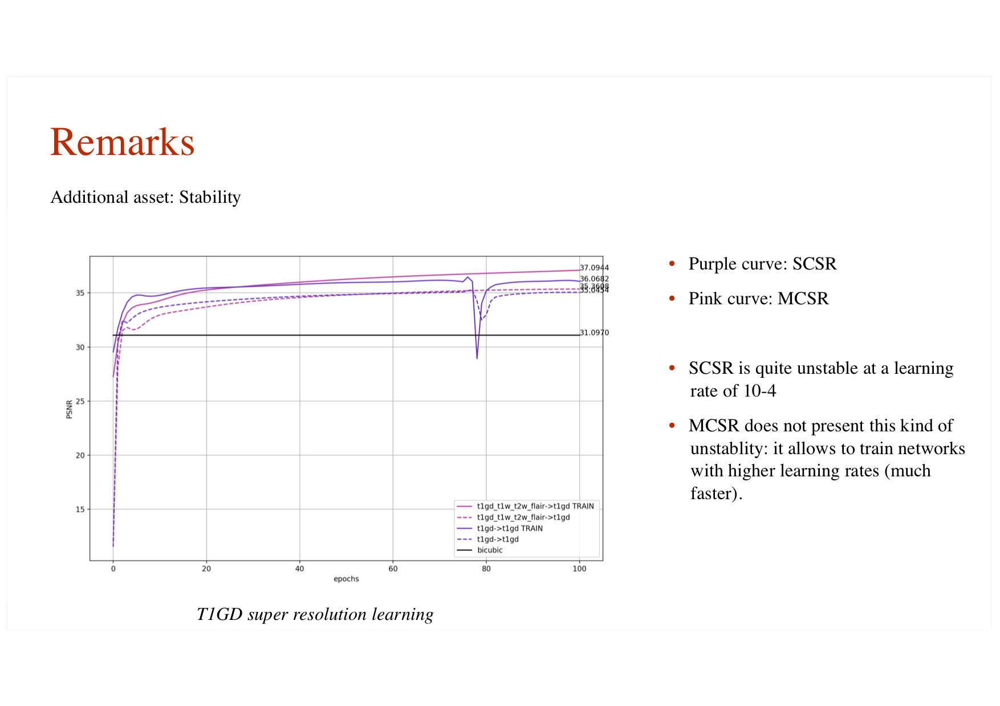

Generalization:
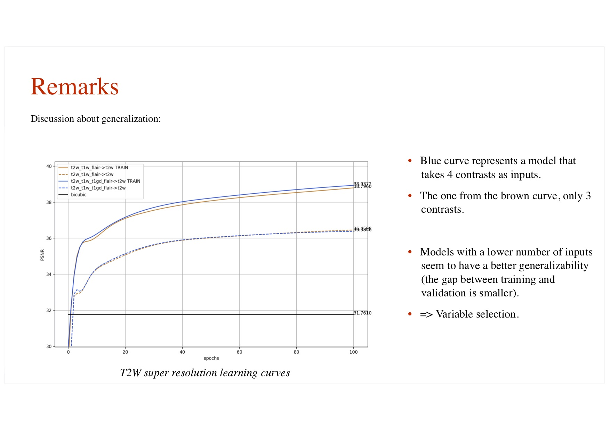
